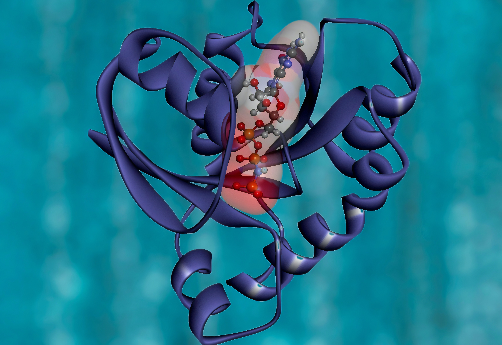
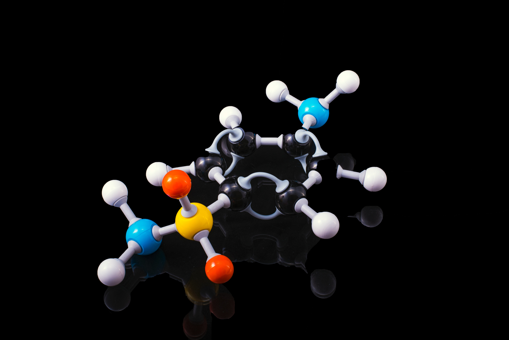

# Portfolio
---
## Machine Learning & AI in Computational Biology

### Next Generation Sequencing Analysis

Different Protocols used to analyse the Next generation sequencing data, using Python and Galaxy Server workflows

Next Generation Sequencing is a Method to Sequence DNA. It has the potential to tuen out to be the most promising diagostic and Genome exploration tools. It costed about $3 billion to sequence the first human DNA in the early 2000's (Human Genome Project), And today it can cost as low as $1000 and still going down. It is of utmost imortance that more research be carried out in this field.

### Molecular Modeling & Structure Prediction

A very intresting topic in my opinion with a room for a lot of creativity.

Experimental data from X-Ray Crystallography, Nuclear Magnetic Resonance Imaging (NMR) and Sequence of the Molecule from the Sequencing Experiment is used to Predict the Structure of the Biological Molecule. 
Even though a lot of protocols are available a lot of work needs to be done in the field in the future.

### Drug Discovery & Virtual Screening

The need to develop and optimise these technologies is and will be never ending.

The world has seen beter day when it come to Health of the people. Improving drug discovery protocols is the need of the hour and before we start wandering in search of new ones we need to screen the library of all the possible drug like chemicals produced by man and discovered in nature against various deadly diseases and wat better than to use a ML and AL for the job.

